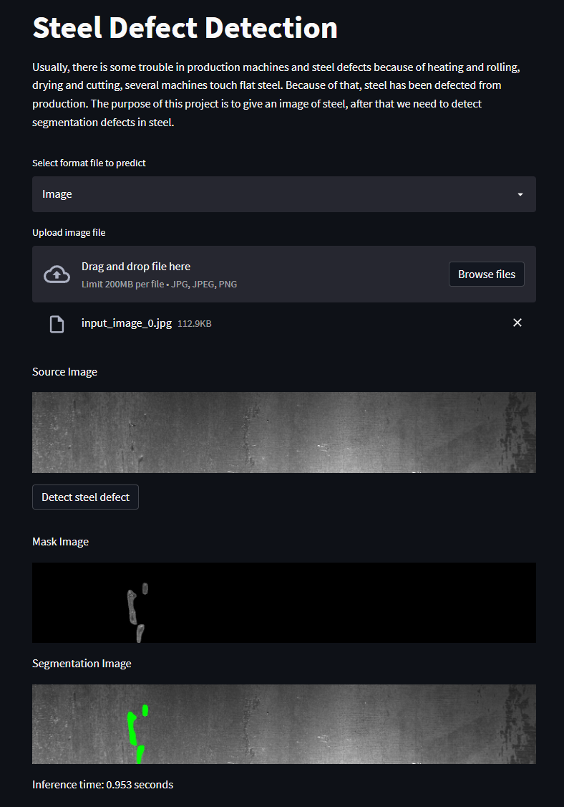

# Steel Defect Detection



## Description

Usually, there is some trouble in production machines and steel defects because of heating and rolling, drying and cutting, several machines touch flat steel. Because of that, steel has been defected from production. The purpose of this project is to give an image of steel, after that we need to detect segmentation defects in steel. Created with HarDNet for segmentation models and streamlit for website deployment.

## Installation

```bash
# Python version 3.7.9 or newer
$ git clone https://github.com/hafidh561/steel-defect-detection.git
$ pip3 install -r requirements.txt
$ python3 download_model.py
```

## Usage

```bash
$ streamlit run app.py
usage: app.py [-h] [-d DEVICE] [-m MODEL]

optional arguments:
  -h, --help            show this help message and exit
  -d DEVICE, --device DEVICE
            Input your device inference between CPU or CUDA
  -d MODEL, --model MODEL
            Path to model onnx

# Example arguments input
$ streamlit run app.py -- --device CUDA --model model.onnx
```

## License

[MIT LICENSE](./LICENSE)

© Developed by [hafidh561](https://github.com/hafidh561)
